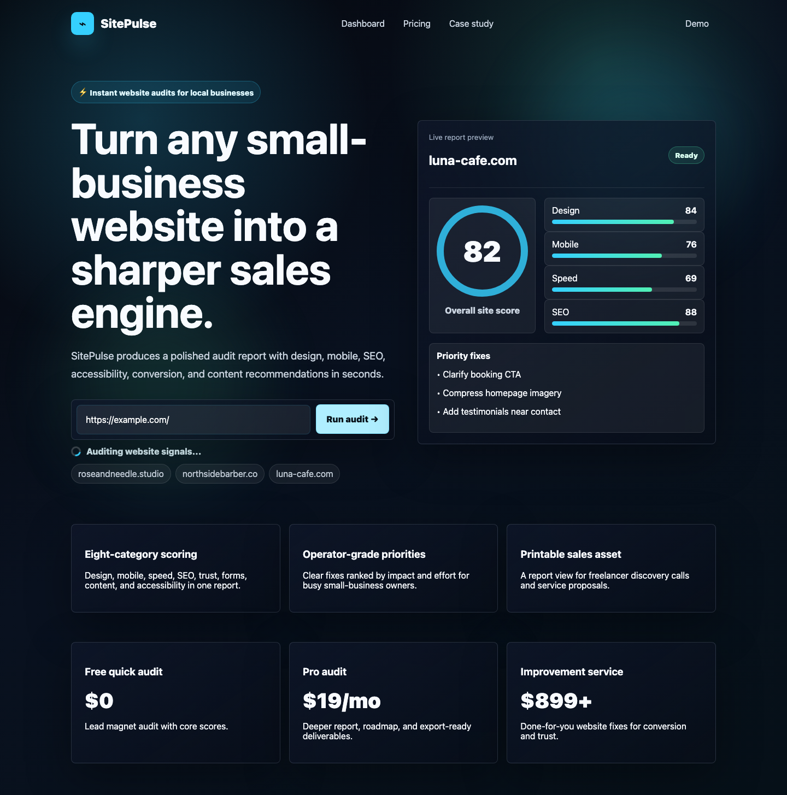
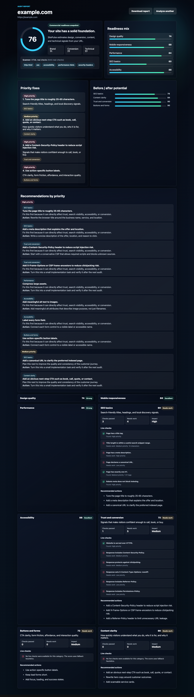
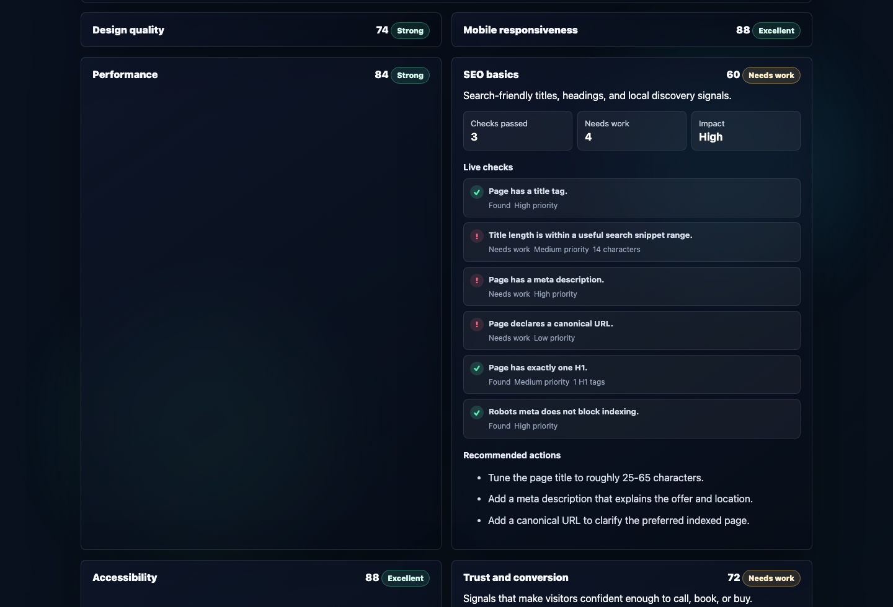
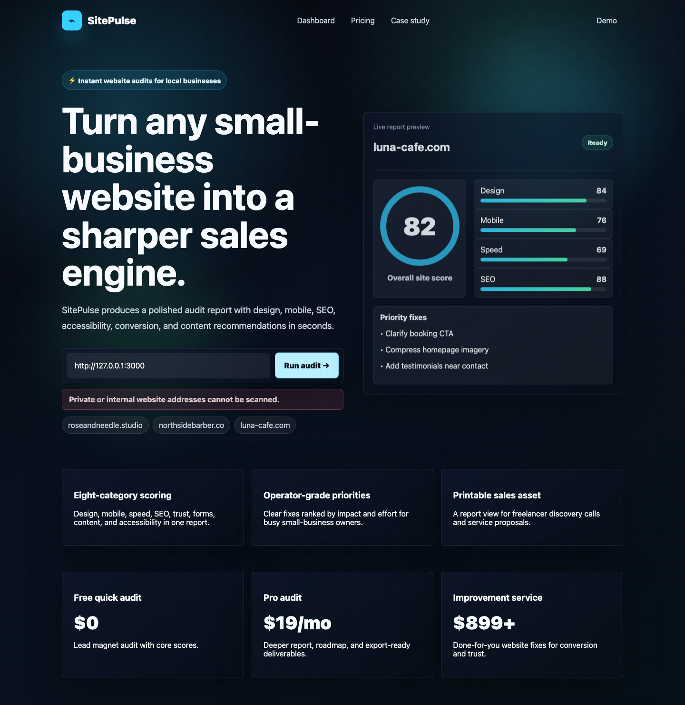
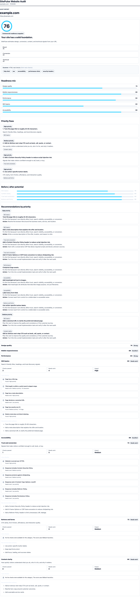

# SitePulse

SitePulse is a portfolio-grade website audit dashboard for small businesses. Users enter a website URL and receive a polished audit report with scores, live HTML checks, security-minded recommendations, and prioritized next steps.

The project is intentionally built as a local MVP/demo foundation: the UI feels like a premium SaaS dashboard, while the backend already includes a modular scanner pipeline, API validation, SSRF protection, privacy controls, SQLite persistence, and automated tests.

## GitHub Repository Summary

One-line description:

```text
Premium website audit dashboard with a Node.js backend, SQLite storage, SSRF-safe HTML scanner, and Playwright-tested SaaS-style report UI.
```

Tech stack:

```text
HTML/CSS/JavaScript, Node.js, SQLite, Playwright, Node test runner
```

Portfolio value:

```text
Shows full-stack product execution: polished UI, backend API, secure scanner pipeline, privacy controls, persistence, testing, and deploy-aware documentation.
```

## What It Does

- Accepts a public website URL.
- Runs a safe HTML-based audit scanner.
- Scores eight audit categories:
  - Design quality
  - Mobile responsiveness
  - Performance
  - SEO basics
  - Accessibility
  - Trust and conversion
  - Buttons and forms
  - Content clarity
- Shows an interactive report with:
  - Overall score
  - Category scores
  - Live checks
  - Priority fixes
  - Recommendations grouped by priority
  - Scanner mode and adapters used
  - Safe error states for invalid or private/internal URLs

## Tech Stack

- Frontend: HTML, CSS, vanilla JavaScript
- Backend: Node.js ESM HTTP server
- Storage: SQLite via Node's built-in `node:sqlite`
- Testing: Node test runner and Playwright
- Security: SSRF-aware scanner fetch, API validation, rate limiting, security headers

Node's `node:sqlite` module is currently marked experimental by Node. Lighthouse 13 sets the effective project minimum to Node.js `22.19+`.

## Portfolio Value

This project demonstrates:

- Product-minded frontend UI for a SaaS-style audit dashboard.
- Backend API design with health, audit create/read, and protected admin summary routes.
- SQLite storage with clean repository boundaries.
- Scanner pipeline architecture that can later accept Lighthouse, Playwright, axe-core, or queue-based adapters.
- SSRF protection before scanning user-supplied URLs.
- Privacy cleanup: public users cannot fetch the full audit history.
- Security-minded development: validation, safe errors, body limits, rate limiting, static file allowlist, and security headers.
- E2E testing of the main user flow and important error states.
- Modular code organization without coupling SQL or scanner internals into routes.

## Scanner Checks

Current scanner mode:

- `html-real-checks`: safely fetches target HTML and runs adapter-based checks.
- `fallback`: used when live HTML scanning fails for non-safety reasons.
- Rendered checks are additive and feature-flagged; a Lighthouse failure retains the completed HTML audit.

Active adapters:

- `http-html`: SSRF-aware HTML fetcher with manual redirect checks, timeout, and response size limit.
- `seo`: title, meta description, canonical, H1 count, robots meta, and basic Open Graph checks.
- `accessibility`: image alt attributes, form labels, button names, document language, and heading structure.
- `performance-hints`: response time, HTML size, script/style count, large inline script/style, and caching headers.
- `security-headers`: HTTPS plus Content-Security-Policy, frame protection, X-Content-Type-Options, Referrer-Policy, and Permissions-Policy checks.
- `lighthouse-playwright` (optional): rendered Chromium audit with LCP, CLS, FCP, Speed Index, TBT, and Lighthouse category scores.

The rendered adapter uses Playwright network routing to revalidate public destinations for page requests, redirects, subresources, and WebSockets before Lighthouse connects. It is disabled by default because a browser audit is materially slower and more resource-intensive than the HTML scanner.

The report presents rendered results under **Real Page Performance**. It summarizes five user-facing measurements with `Good`, `Needs improvement`, and `Poor` bands, then shows up to three fixes backed by Lighthouse diagnostics. Detailed category checks retain the full scores and metric evidence without overloading the main summary.

Lighthouse cannot honestly measure INP during a load-only lab run because there is no representative user interaction. SitePulse exposes TBT as `inpLabProxy: "TBT"`; it does not label TBT as INP. Real INP requires field/RUM data or a defined interactive user flow.

## Project Structure

```text
server.mjs                  App entrypoint
index.html                  Frontend application and report UI
src/config/                 Runtime config
src/audit/                  URL validation, safety, scanner pipeline, scoring, recommendations
src/audit/scanners/         HTML scanner and adapter modules
src/http/                   App factory, routes, errors, security, body parsing, static files
src/storage/                SQLite audit repository
test/                       Unit and API tests
e2e/                        Playwright browser tests
scripts/reset-db.mjs        Local SQLite reset helper
playwright.config.mjs       E2E web server config
```

Runtime files are ignored by Git:

```text
node_modules/
test-results/
playwright-report/
.env
.env.*
data/*.sqlite
data/*.sqlite-shm
data/*.sqlite-wal
data/*.json
coverage/
*.log
.DS_Store
```

## Requirements

- Node.js `22.19+`
- Recommended Node version from `.node-version`: `24.14.0`
- pnpm
- Chromium for Playwright e2e tests

For a full new-Mac restore, read:

- [MIGRATION.md](MIGRATION.md): project restore guide, environment variables, ignored files, and one-prompt Codex restore flow.
- [MACHINE_SETUP.md](MACHINE_SETUP.md): machine-level Git, Homebrew, Node, pnpm, Playwright, SQLite, VS Code, CLI, and Codex notes.
- [migration_backup/](migration_backup/): safe non-secret restore notes and templates.
- [PROJECT_HEALTH_REPORT.md](PROJECT_HEALTH_REPORT.md): latest environment, Git, test, security, performance, architecture, and technical-debt verification.

## Install

```bash
pnpm setup
```

This runs `setup.sh`, which checks Node.js, installs dependencies, installs Playwright Chromium, creates local runtime files, and runs unit tests.

## Run Locally

Start the web process in terminal 1:

```bash
pnpm start
```

Start the audit worker in terminal 2, using the same `.env` and `DATABASE_FILE_PATH`:

```bash
pnpm worker
```

Open:

```text
http://localhost:3000
```

Development alias for the web process:

```bash
pnpm dev
```

## Move To A New Mac

The repository is prepared so the new Mac setup is:

```bash
git clone https://github.com/ilontasck/sitepulse.git
cd sitepulse
./setup.sh
pnpm start
```

Before moving, push the project from the old Mac:

```bash
git status --short --ignored
pnpm test
git add .
git commit -m "Prepare complete Mac migration docs"
git push
```

Current `origin`:

```text
https://github.com/ilontasck/sitepulse.git
```

Files intentionally not moved through Git:

```text
node_modules/
.env
.env.*
data/*.sqlite
data/*.sqlite-shm
data/*.sqlite-wal
data/*.json
test-results/
playwright-report/
blob-report/
playwright/.cache/
coverage/
.pnpm-store/
.npm/
.yarn/
.yarn-cache/
dist/
build/
.cache/
.parcel-cache/
.vite/
.turbo/
*.log
tmp/
temp/
.DS_Store
.vscode/
.idea/
```

If the local SQLite database contains work you need to preserve, export or copy `data/sitepulse.sqlite` separately. It is intentionally ignored because it is runtime state, not source code.

## Demo Script

1. In terminal 1, start the web process with `pnpm start`.
2. In terminal 2, start the audit worker with `pnpm worker`.
3. Open `http://localhost:3000`.
4. Enter `https://example.com/`.
5. Run the audit and observe the queued/running state before the report opens.
6. Review the report:
   - Overall score
   - Category cards
   - Live checks
   - Priority recommendations
   - Scanner metadata and adapters
7. Try `not a website` and confirm a friendly validation error.
8. Try `http://127.0.0.1:3000` and confirm private/internal URLs are blocked before enqueue.

## Suggested Screenshots

Real screenshots are stored in `docs/screenshots/`:

| Landing | Loading |
| --- | --- |
|  |  |

| Report | Category Detail |
| --- | --- |
|  |  |

| Unsafe URL Error | Print View |
| --- | --- |
|  |  |

If you want to refresh screenshots manually for a portfolio case study, capture:

- Landing page: hero, URL form, and live preview card.
- Loading state: form submitted while the audit spinner is visible.
- Final report: overall score, scanner metadata, priority recommendations, and category checks.
- Category detail: one expanded category showing live checks and recommended actions.
- Error state: private/internal URL blocked with the friendly error message.
- Print view: A4 report preview with buttons and decorative background removed.

## Test Commands

Unit and API tests:

```bash
pnpm test
```

Alias for the same unit/API test suite:

```bash
pnpm test:unit
```

Browser e2e tests:

```bash
pnpm test:e2e
```

All tests:

```bash
pnpm test:all
```

Reset local SQLite database:

```bash
pnpm reset-db
```

## Environment Variables

`setup.sh` creates `.env` from `.env.example` when `.env` does not exist. Keep real secrets only in `.env`; it is ignored by Git.

```text
HOST=127.0.0.1
PORT=3000
NODE_ENV=development
DATABASE_FILE_PATH=./data/sitepulse.sqlite
ADMIN_API_KEY=
REQUEST_BODY_LIMIT_BYTES=32768
RATE_LIMIT_WINDOW_MS=60000
RATE_LIMIT_MAX=60
RENDERED_AUDIT_ENABLED=false
RENDERED_AUDIT_TIMEOUT_MS=45000
RENDERED_AUDIT_MAX_CONCURRENCY=1
AUDIT_WORKER_POLL_INTERVAL_MS=500
AUDIT_JOB_LEASE_MS=30000
AUDIT_JOB_HEARTBEAT_MS=10000
TELEMETRY_ENABLED=true
```

Notes:

- `DATABASE_FILE_PATH` controls the SQLite database location.
- `ADMIN_API_KEY` enables protected `GET /api/audits` summaries.
- `RENDERED_AUDIT_ENABLED=true` enables the slower Lighthouse/Playwright adapter. The default keeps the original HTML audit behavior.
- `RENDERED_AUDIT_TIMEOUT_MS` bounds the Lighthouse phase. Navigation or Chromium failures become scanner warnings and keep the HTML result.
- `RENDERED_AUDIT_MAX_CONCURRENCY` limits active Chromium audits per Node process. The beta default is `1`; excess requests complete with HTML findings instead of waiting in an unbounded queue.
- `AUDIT_WORKER_POLL_INTERVAL_MS` controls how often the worker looks for queued jobs while idle.
- `AUDIT_JOB_LEASE_MS` and `AUDIT_JOB_HEARTBEAT_MS` protect running jobs from duplicate completion; the heartbeat must be shorter than the lease.
- `TELEMETRY_ENABLED` controls privacy-safe JSON audit events on stdout. Test environments keep the collector active but suppress output unless explicitly injected.
- `.env` is ignored and should not be committed.

## API Overview

### `GET /api/health`

Returns service health.

### `POST /api/audits`

Validates the URL, creates a persistent audit job, and returns immediately with `202 Accepted`.

```json
{
  "websiteUrl": "https://example.com/"
}
```

The response contains a queued job and its polling URL:

```json
{
  "job": {
    "id": "...",
    "status": "queued",
    "createdAt": "...",
    "statusUrl": "/api/audit-jobs/..."
  }
}
```

### `GET /api/audit-jobs/:id`

Returns the safe public job status. A completed job includes `auditId` and `auditUrl`; a failed job includes only a safe error code and message.

### `GET /api/audits/:id`

Returns one audit report by unguessable UUID.

### `GET /api/audits?limit=20`

Admin-only summary endpoint. Requires:

```text
X-Admin-Key: your-admin-key
```

It returns summaries only, not full category/recommendation payloads.

## Security And Privacy

- Rejects invalid, unsupported, localhost, and private/internal URLs.
- Resolves hostnames before scanning and blocks private/internal IP ranges.
- Manually validates redirect targets instead of blindly following redirects.
- Revalidates rendered-browser requests and WebSockets with the same public-destination policy.
- Starts rendered audits with a fresh profile, reduced Chrome background networking, and blocked service-worker registration.
- Limits redirects, request time, and downloaded HTML size.
- Requires JSON request bodies.
- Applies JSON body size limits.
- Uses basic in-memory API rate limiting.
- Applies security headers globally.
- Serves static files through an allowlist.
- Keeps audit history private unless `ADMIN_API_KEY` is configured.
- Returns safe JSON errors without stack traces.

Rendered-browser application checks are defense in depth, not a network sandbox. Before an Internet-facing production launch, follow [PRODUCTION_BROWSER_SECURITY.md](PRODUCTION_BROWSER_SECURITY.md) and enforce public-only egress outside Chromium.

## Audit Telemetry

With `TELEMETRY_ENABLED=true`, SitePulse writes one JSON object per audit event to stdout. Events cover total audit duration and outcome, Lighthouse duration, HTML/rendered fallback reason, timeout, Chromium crash, and concurrency rejection. The collector also maintains in-process counters through its `snapshot()` interface so a future monitoring adapter can export them without changing the audit pipeline.

Telemetry uses an explicit field allowlist. It does not emit target URLs, HTML, request headers, cookies, environment values, secrets, tokens, or report contents.

Local beta measurements on the bundled Chromium build showed roughly 1.5 GiB peak aggregate Chromium RSS and about 1.3 CPU cores at the busiest sample for one `example.com` audit. Keep concurrency at `1` unless the deployment has measured headroom.

## Storage

SQLite database:

```text
data/sitepulse.sqlite
```

The database is initialized automatically. The `audits` table stores summary columns plus a full JSON report payload:

- `id`
- `created_at`
- `updated_at`
- `normalized_url`
- `domain`
- `overall_score`
- `scanner_mode`
- `report_json`

Reset it with:

```bash
pnpm reset-db
```

## Deploy Readiness

Good demo targets:

- Render
- Railway
- Fly.io
- A small VPS
- Any Node.js host that can run a persistent process and write to local disk

SQLite caveat:

- SQLite is fine for a local MVP and portfolio demo.
- On serverless or ephemeral platforms, local SQLite files may disappear between deployments or instances.
- A real SaaS deployment should use Postgres for durable storage, backups, concurrent access, and easier horizontal scaling.

Before production:

- Replace local SQLite with Postgres.
- Add authenticated user accounts.
- Move slow scans into a background job queue.
- Add hosted file/report export.
- Run rendered audits in an isolated worker/egress sandbox and add axe-core user-flow checks.
- Add monitoring and structured logs.
- Configure production `ADMIN_API_KEY`, `DATABASE_FILE_PATH` or Postgres env vars, and stricter rate limits.

## Before Pushing To GitHub

Run this quick checklist:

```bash
git status
pnpm setup
pnpm test
pnpm test:e2e
pnpm reset-db
```

Then verify:

- `.env` is not present in Git.
- `node_modules/` is not staged.
- `data/*.sqlite`, `data/*.sqlite-shm`, `data/*.sqlite-wal`, and `data/*.json` are not staged.
- `test-results/` and `playwright-report/` are not staged.
- Screenshots in `docs/screenshots/` are current.
- README commands still match `package.json`.

## Roadmap

- Median-of-three Lighthouse runs and historical trends
- Field Core Web Vitals through CrUX/RUM
- axe-core accessibility adapter
- Authenticated report history
- Branded PDF export
- Background scan queue
- Postgres storage for hosted production
- Public demo deployment
